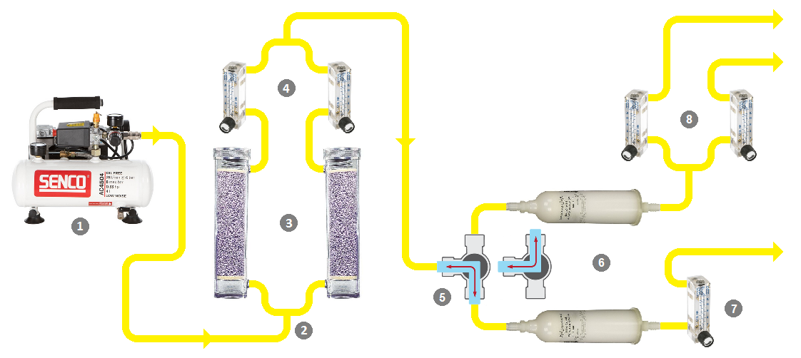
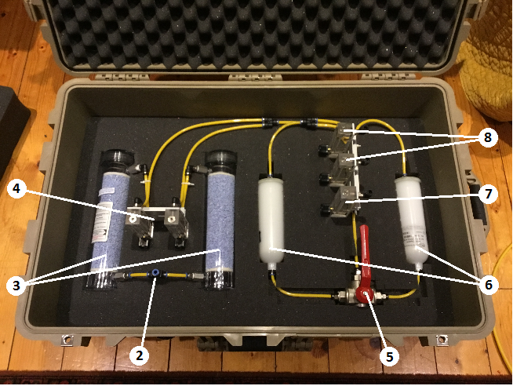
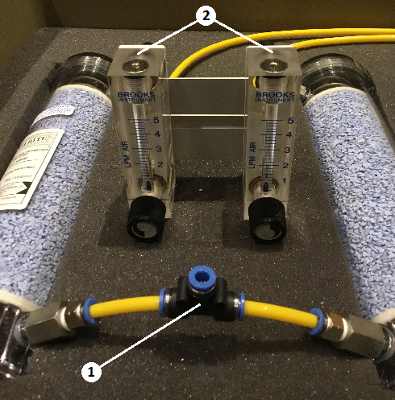
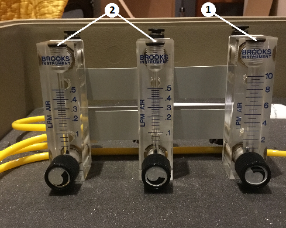

[<-- Back to documentation overview](../documentation.md)

# Air dryer/filter system setup guidelines

Author: Seb Sikora, March 2021.

Last modified:  Seb Sikora, March 2021.

## Instructions for setting-up the air treatment (dryer & particle filter) system.

## 1. Introduction & overview:

Blah...

Blah...

---

## 2. Essential safety considerations:

Blah...

---

## 3. Working with pneumatic push-fit connectors:

Webpage explanation of pneumatic push-fit connectors (external link): [tameson.co.uk](https://tameson.co.uk/push-in-fittings.html)

Video guide to pneumatic push-fit connectors (external link): [youtube.com](https://www.youtube.com/watch?v=b8RFjh6Y-fM)

Note: The tubing dimensions referred to in the above video are in US imperial measurements. The air-treatment system exclusively comprises 6mm metric pneumatic tubing, however the metric fittings operate exactly as those shown in the video.

---

## 4. Anatomy of the air-treatment system:

### 1. Compressor:

Blah...

### 2. Intake connector:

Blah...

### 3. Drierite cartridges: 

Blah...

### 4. Inlet rotameters:

Blah...

### 5. 3 way (L) valve:

Blah...

### 6. HEPA filter capsules:

Blah...

### 7. High-flow output rotameter:

Blah...

### 8. Low-flow output rotameters:

Blah...

---
