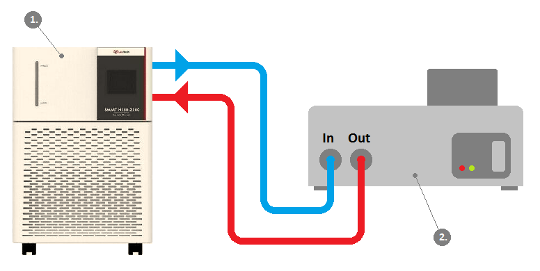
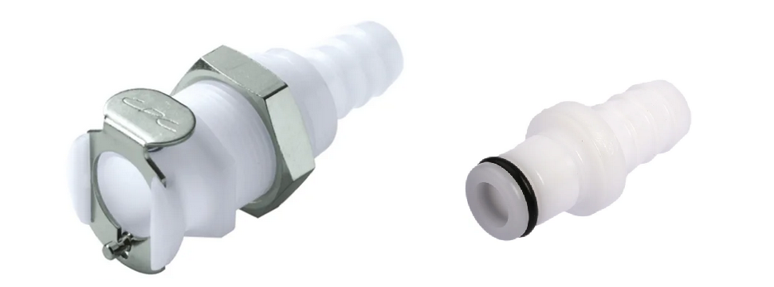
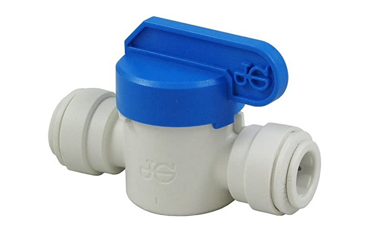
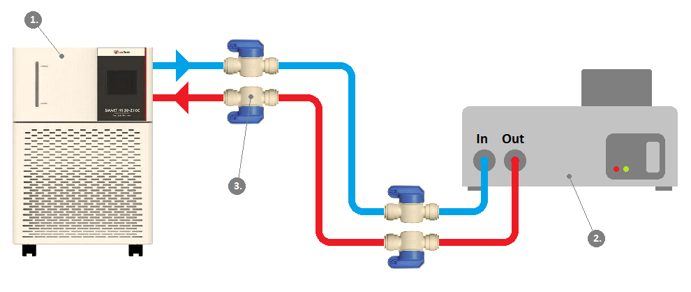
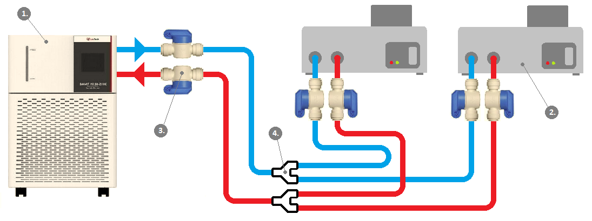
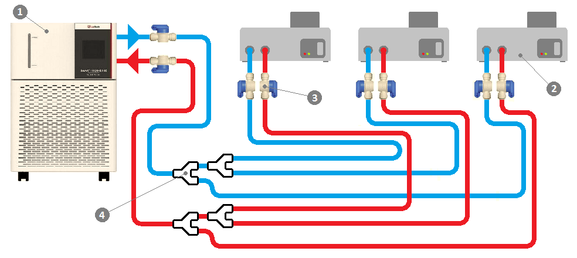
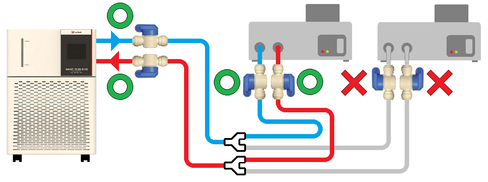
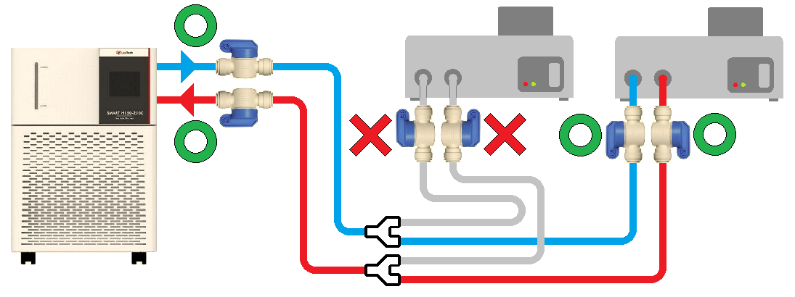

# Cooling-loop setup guidelines

Author: Seb Sikora, March 2021.

Last modified:  Seb Sikora, March 2021.

## Instructions for setting-up the cold-stage recirculating cooling-loop.

## 1. Introduction:

Operation of the solid-state cold-stage requires a continuous supply of coolant media held at ~ +5 deg C. This coolant media acts as a heat source/sink that supplies heat to- or removes heat rejected by the peltier thermoelectric element that forms the active heat-pump within the cold-stage. 

It is recommended that a laboratory recirculating chiller system is used for this purpose, connected to the cold-stage in a closed-loop as shown in it's simplest form in Fig. 1. 

---

## 2. Cooling-loop requirements:

### i. Cooling media:

Consult the documentation provided by the recirculating chiller manufacturer for recommended coolant media. 

As a guideline, the coolant media must have a freezing point below the coldest part of the chiller mechanism, which can be as low as around - 30 deg C. This can be achieved using standard ethylene glycol anti-freeze ...

### ii. Fluid couplers:

Locking panel-mount coupling body: [rs-online](https://uk.rs-online.com/web/p/hose-couplings/7640699/)

Locking in-line coupling insert: [rs-online](https://uk.rs-online.com/web/p/hose-couplings/0138385/)

Each cold stage is fitted with two locking hose coupling bodies at the front of the instrument. These mate with corresponding coupling inserts

### iii. Fluid valves:

Blah...

### iv. Cooling capacity (power):

Multiple cold-stages can be connected to a single recirculating chiller, limited by it's total cooling-capacity. Though the heat rejected by a single cold-stage will depend on it's operating condition and applied thermal loads, as a guideline allow ~XXX W of cooling capacity per 30 mm cold-stage or ~XXX W of cooling capacity per 52 mm cold-stage respectively.

If the recirculating chiller is not able to hold the bulk coolant media at or around 5 deg C during cold-stage operation, it indicates that the chosen recirculating chiller does not provide adequate cooling capacity for the desired cold-stage configuration.

### v. Coolant flow-rate:

A coolant flow-rate of ~

---

## 3. Recommended system configuration:

### i. Single cold-stage:

Blah...

### ii. Two cold-stages:

Blah...

### iii. Multiple cold-stages:

Blah...

---

## 4. Coolant loop priming guide:

Blah...

Blah...

---

## 5. Care tips:

Blah...

---
