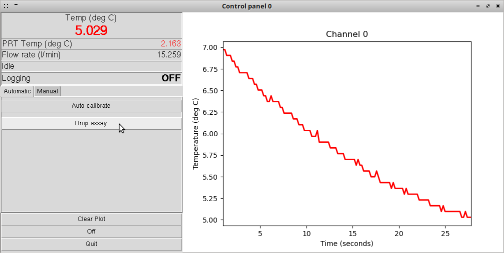
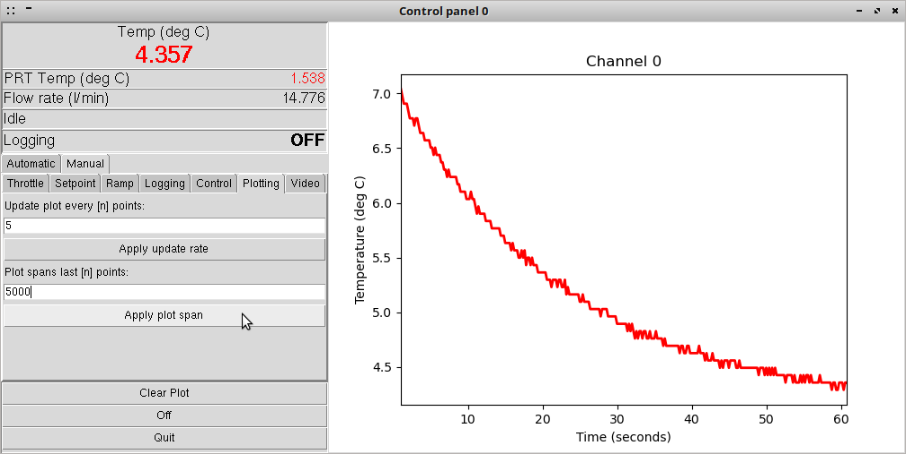
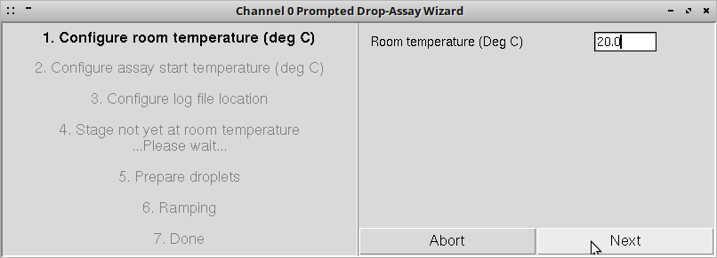
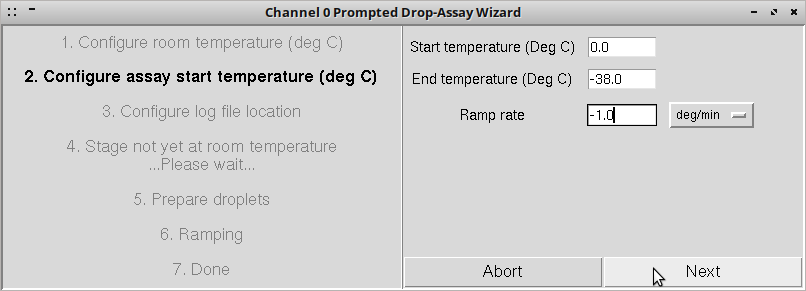
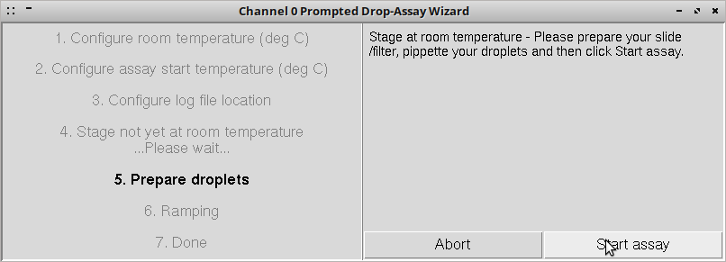
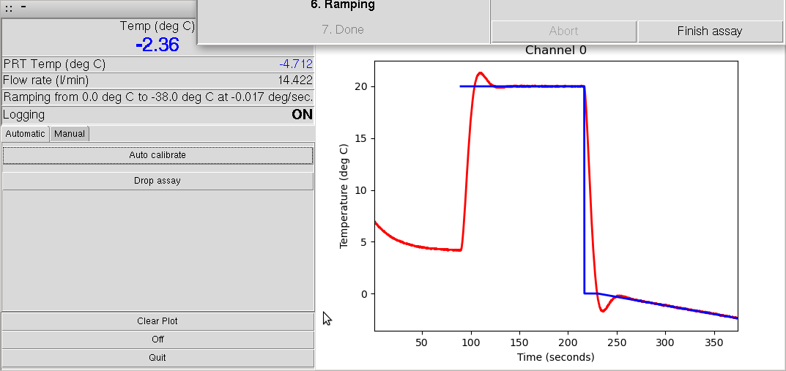
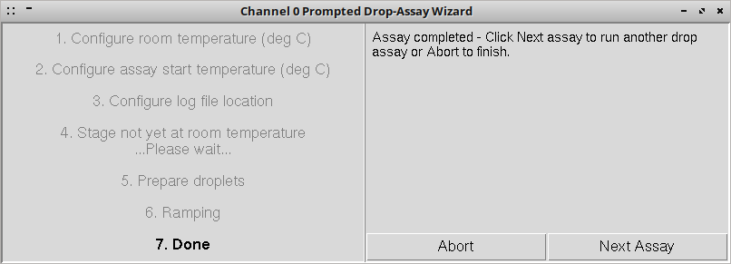

# Getting started with the cold-stage control software

## How to have a play with the cold-stage control software using 'simulation mode'.

---

## 1. Starting the control software:

 

To start the control software by entering ColdStage.py at the command line when in the program directory. 

The control software will attempt to initialise any physical cold-stages that are connected to the system, and attempt to initialise the web-cam if one is connected, before opening the device selection window (see Fig.1).

On Linux systems, several 'virtual' COM ports exist even when no physical serial devices are connected, and for this reason the software will report that it was unable to connect to the device connected to those ports (see Fig.1). This is expected behaviour. The penultimate row in the terminal shows the software acknowledge the virtual 'simulation_test_device', ID 0, which allows the user to interact with a virtual simulated cold-stage. The final row in the terminal output shows a message from the web-cam driver software, and is normal and expected behaviour.

---

## 2. Device selection window:

Within the device selection window, from the drop-down list box under 'Available Devices' select 'Device: 0, simulation_test_device' to explore the virtual cold-stage.

If a physical cold-stage is connected to the system, an entry for it will appear in the drop-down list. When an entry from the drop-down list is selected (except for the virtual cold-stage), the corresponding physical cold-stage will briefly strobe it's activity light in greeting. This is to ease in identification if multiple physical cold-stages are simultaneously connected.

Any available video devices (eg web-cam) connected to the system are enumerated at start up. These can be cycled through by incrementing the numerical spin-box under 'Video Device ID'. If a video-device is selected a preview will be shown in the centre of the device selection window.

Note - A prompted drop-assay cannot be run with video disabled. To run a prompted drop-assay using the virtual cold-stage without a web-cam connected, leave the 'Disable Video' option box un-checked.

Now click 'Start' to start the control-software control panel.

---

## 3. Main control panel:

The main control-panel will open and appear and appear as in Fig.3. On the left are the controls, and on the right is the temperature time-series plot.

The main readouts are in the top-left of the control panel. In red at the top is the most recent primary temperature reading (deg C). Under this are the most recent secondary temperature reading (deg C), cooling loop flow rate (litres/minute), the mode indicator and the logging indicator.

Under the main readouts are the control tabs, split into two categories; 'Automatic' & 'Manual'.

To explore the prompted drop-assay, ensure the 'Automatic' tab is selected, and then click the 'Drop Assay' button (Fig.3).

The 'Manual' tab contains a selection of sub-tabs which contain the full manual controls for the cold-stage. Of particular relevance when exploring the prompted drop-assay is the 'Plotting' tab (Fig.4). On this, the x-axis span (in datapoints, which by default are recorded at 5 Hz.) can be adjusted by changing the numeric entry field and clicking 'Apply plot span'.

---

## 4. The prompted drop-assay wizard:

The prompted drop-assay wizard exists to help the user to run a basic droplet-freezing assay by walking the user through each step in-turn. 

Briefly, a to run a droplet-freezing assay the user needs to configure the cold-stage software with i) the current labortatory room temperature, ii) the droplet-freezing assay parameters (start and end temperatures, and temperature ramp rate) and iii) the filesystem location in which the tabular temperature data and video logs generated during the droplet-freezing assay will be stored. 

The prompted drop-assay wizard asks the user to configure each of these in turn, then holds the cold-plate at room temperature while the user prepares their droplets on the cold-stage, although when using 'simulation mode' no pysical experiment is prepared or performed.

The wizard window is split vertically into two halves (Fig. 5), showing the numbered steps comprising a prompted drop-assay on the left and any corresponding instructions, numerical entry fields, buttons or other controls on the right. The numerical entry fields will always contain a sensible default entry.

The two main buttons are in the window lower-right. These can change function depending on context, but during most of a prompted drop assay comprise; Abort - which will cancel the current drop-assay and close the wizard window, and Next which will advance the wizard to the next step.

### i. Setting the room temperature:

Set the current laboratory room temperature by entering a temperature (in deg C) in the numeric entry field on the right [Fig.4], then click Next.

### ii. Configuring the drop-assay ramp parameters:

The three principal parameters involved in a droplet-freezing assay are the ramp parameters - that is - the start temperature, and temperature and temperature ramp rate. Enter these in the numeric entry fields on the right of the wizard window (Fig.7).

The ramp start and end temperatures must be entered in degrees C. The temperature ramp rate can be entered in either degrees C per second, or degrees C per minute.

### iii. Selecting the log-file path:

The cold-stage control software stores experimental data in the form of a folder containing a .csv file in which the numerical tabular data is recorded, and a time-series of .png images captured via the camera.

The filesystem location in which the folder will be created is selected using a standard file-picker dialog box, the look and feel of which will vary slightly between operating systems.

### iv. 'Preparing the droplets':

At this point - once the cold-stage has brought the cold-plate to the requested room temperature - in a live experiment the user would now prepare their experimental materials on the cold-plate, ready to begin the experiment proper. 

Eg: For a drop-assay conducted using the 'wash off' method, the user would prepare a clean microscope cover slide placed on the cold-plate, before pipetting an array of droplets onto the upper surface of the cover slide. The Lighting/Camera head would then be installed, before progressing to the next stage.

If the cold-stage has yet to bring the cold-plate to the desired room-temperature, the user will be instructed to wait until this is reached.

Note that the button in the bottom-right corner of the wizard window now reads 'Start Assay'. Click on this to begin the temperature ramp.

### v. Running the drop-assay:

Once the user has clicked 'Start Assay', the cold-stage will start the data logger, before cooling the cold-plate to the ramp start temperature as rapidly as possible. 

Once the cold-plate temperature reaches the ramp start temperature, the temperature setpoint will then advance linearly at the desired temperature ramp-rate, which can be observed in the main control-panel window (Fig.7).

Note that the button in the bottom-right corner of the wizard window now reads 'Finish Assay'. During a live experiment, in the event that all of the droplets in the array freeze prior to the cold-plate reaching the ramp end temperature, the user can click on this button to end the experiment. Otherwise, the experiment will end automatically once the cold-plate reaches the ramp end temperature.

### vi. Running multiple drop-assays.

If the user wishes to run multiple droplet-freezing assays in succession, once the current assay is complete click 'Next Assay' in the bottom right corner of the wizard window. This will return the wizard to step (ii). 

Alternatively, click 'Abort' to leave the prompted drop-assay wizard.

If the user wishes to change the configured room temperature, click 'Abort' and then re-start the prompted drop-assay wizard.
