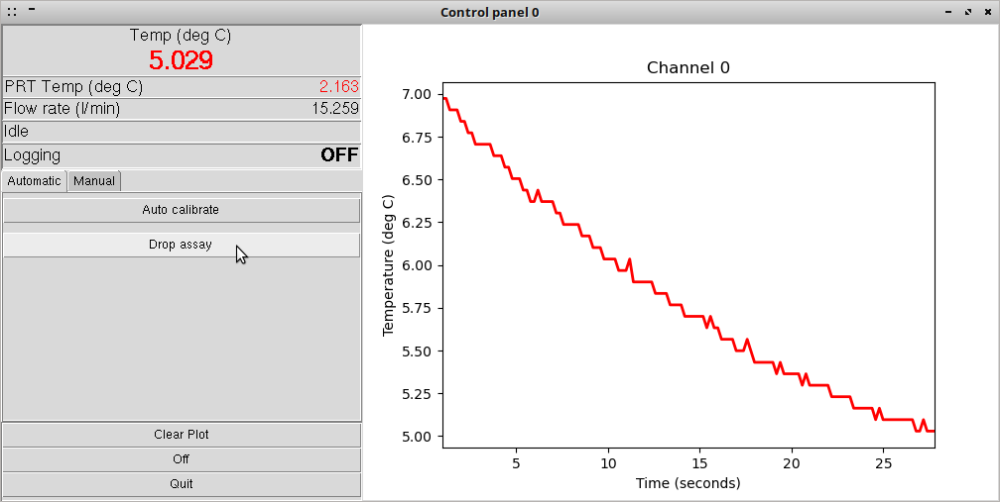

Getting started with the cold-stage control software
-------------------------------------------------

How to have a play with the cold-stage control software using 'simulation mode'.

1. Starting the control software:

 

First-off, start the control software by entering ColdStage.py at the command line, when in the program directory. The control software will attempt to initialise any physical cold-stages that are connected to the system, and attempt to initialise the web-cam if one is connected, before opening the device selection window (Fig.1).

On Linux systems, several 'virtual' COM ports exist even when no physical serial devices are connected, and for this reason the software will report that it was unable to connect to the device connected to those ports (see Fig.1). This is expected behaviour. The penultimate row in the terminal shows the software acknowledge the virtual 'simulation_test_device', ID 0, which allows the user to interact with a virtual simulated cold-stage. The final row in the terminal output shows a message from the web-cam driver software, and is normal and expected behaviour.

2. Device selection window:

The drop-down menu under 'Available Devices' contains a list of all compatible cold-stage devices connected to the system, always including the virtual cold-stage simulation 'Device: 0, simulation_test_device' (Fig.2). To run the virtual cold-stage simulation, ensure that Device 0 is selected. If a web-cam is connected to the system, Under 'Video Device ID' increment the id number in the numerical spin-box until the web-cam image appears in the preview, above. If no web-cam is connected to the system, this can be ignored. The control software needs to think it has a web-cam connected before it will allow a prompted drop-assay to be conducted. For this reason, if you wish to attempt a prompted drop-assay do *not* check the 'Disable Video' option box below, even if a web-cam is not connected to the system.

Now click 'Start' to open the main control panel.

3. Main control panel:

Blah.
