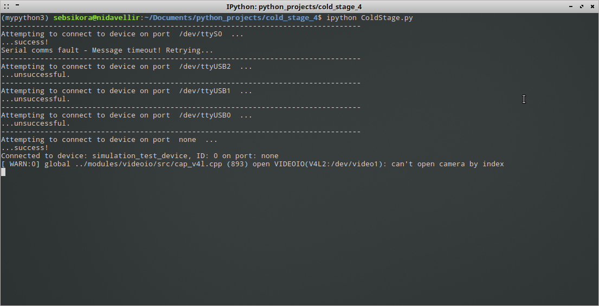
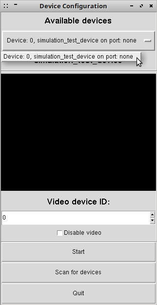

Getting started with the cold-stage control software
-------------------------------------------------

How to have a play with the cold-stage control software using 'simulation mode'.

1. First-off, start the control software by entering ColdStage.py at the command line, when in the program directory. The control software will attempt to initialise any physical cold-stages that are connected to the system, and attempt to initialise the web-cam if one is connected. 

On Linux systems, several 'virtual' COM ports exist even when no physical serial devices are connected, and for this reason the software will report that it was unable to connect to the device connected to those ports (see Fig.1). This is expected behaviour. The penultimate row in Fig.1 shows the software acknowledge the virtual 'simulation_test_device', ID 0, which 

2. Blah blah blah...
