# Manual control tabs.

The manual control tabs comprise the cold-stages main control interface, providing temperature control via one of three modes (Throttle mode, Setpoint mode and Ramp mode), configuration of the temperature & image data logging and configuration of the cold-stage runtime parameters. 

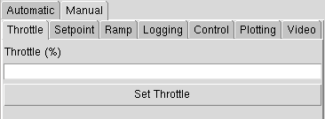

Working from left-to-right, we see;

Temperature Control Modes:
- [Throttle](#throttle)
- [Setpoint](#setpoint)
- [Ramp](#ramp)
    - [Simple Ramp](#simple-ramp)
    - [Program Ramp](#program-ramp)
Cold-stage configuration:
- [Logging](#logging)
- [Control](#control)
- [Plotting](#plotting)
- [Video](#video)

## Throttle.

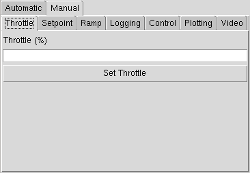

Blah...

## Setpoint.

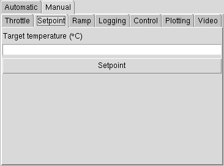

Blah...

## Ramp.

Blah...

### Simple ramp.

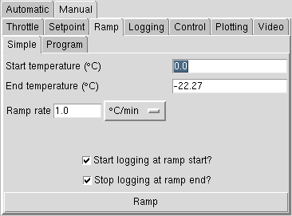

Blah...

### Program ramp.

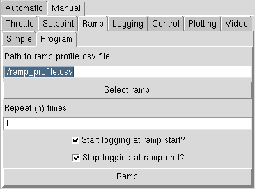

Blah...

## Logging.

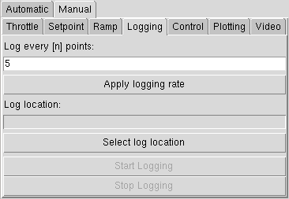
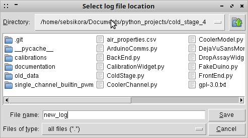
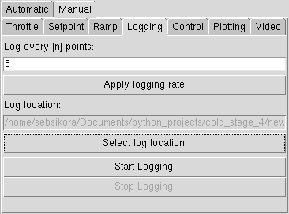

Blah...

## Control.

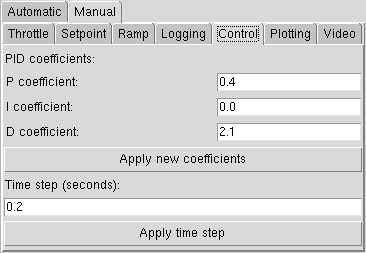

Blah...

## Plotting.

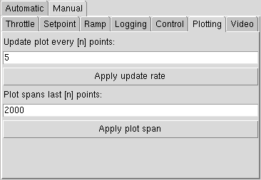

Blah...

## Video.

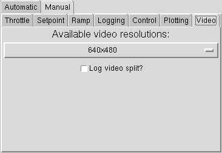

Blah...
